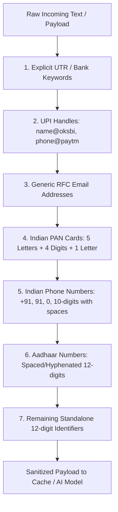

# AI Architecture, Provider Routing & Deterministic Fallback Specification

**Platform:** Makeovers by Prachi  
**Version:** 3.0 (Enterprise Serverless & DPDP 2023 Hardened)  
**Standard:** Distributed Circuit Breaker | Deterministic Rules-First | PII Order-Guarded  

---

## 1. Executive Summary & Free-Tier Reality

### The $0.10 Monthly Inference Credit Reality
Hugging Face's free tier provides **$0.10 of monthly Inference Provider credits**, not an unlimited request quota. At standard token consumption rates, a few hundred chat requests deplete this credit pool, causing external inference requests to fail with **`HTTP 402 Payment Required`**.

### The Core Architectural Principles
1. **"Rules First, AI Second"**: Critical operational data—pricing, calendar slot availability, GST calculations, Section 269ST cash restrictions, and booking confirmation states—are **never** generated or hallucinated by an LLM. They are deterministically resolved from Firestore databases and business rules. The AI layer is strictly used for natural language understanding, tone refinement, and advisory synthesis.
2. **Deterministic Non-AI Fallback**: When external AI APIs encounter `HTTP 402`, `HTTP 429` (Rate Limited), timeouts, or network loss, the system **never fails or shows raw errors**. It seamlessly fails over to pre-compiled, expert-curated studio knowledge templates and prompts direct WhatsApp studio communication (`https://wa.me/${STUDIO_WHATSAPP}`).
3. **Differential Circuit Breaker Durations**:
   - **`HTTP 402 Payment Required`**: The circuit breaker locks **until the 1st of the next calendar month** (next billing cycle reset). Retrying a depleted free-tier pool all month long wastes server compute and adds 2–5 seconds of latency to every user request.
   - **`HTTP 429 Rate Limited`**: Cooldown is set to **60 seconds**.
   - **`Timeouts / 5xx Errors`**: 3-strike threshold with **30-second cooldown**.
4. **Serverless Distributed State**: To prevent cold-start wiping on Vercel and Cloud Functions, circuit breaker state is stored in shared Firestore (`system_state/ai_circuit_breaker`) with an in-memory L1 fast read cache.
5. **Configurable Studio Contact**: The studio WhatsApp link is dynamically injected via `NEXT_PUBLIC_STUDIO_WHATSAPP` / `STUDIO_WHATSAPP`, preventing hardcoded placeholder leakage.
6. **DPDP Act 2023 PII Sanitization**: Indian phone numbers, emails, UPI IDs, PAN, Aadhaar, and bank UTR numbers are sanitized **before** any payload leaves the server. Raw face photos and EXIF location metadata are strictly kept within private Firestore/Cloud Storage and **never** forwarded to free-tier external models.

---

## 2. PII Scrubber Order of Operations

To prevent over-matching, label collisions (e.g. 91-prefixed phone numbers colliding with 12-digit Aadhaar numbers), and false redactions, the scrubber follows a strict deterministic pipeline:



---

## 3. Task-Specific Model Routing Matrix

Rather than routing general chat queries through expensive or unsuited models (e.g. Coder models), the platform utilizes lightweight, task-specific models that minimize compute and credit drain:

| Operational Need | Task Type | Primary Free/Self-Hosted Model | Fallback Engine / Provider |
| :--- | :--- | :--- | :--- |
| **Hinglish/Hindi Bridal Inquiries** | Zero-Shot Intent Classification | `MoritzLaurer/mDeBERTa-v3-base-mnli-xnli` | Deterministic Keyword Regex Matrix |
| **Review Sentiment & Urgency** | Sentiment Analysis | `cardiffnlp/twitter-xlm-roberta-base-sentiment` | Star-Rating Threshold Rules |
| **FAQ & Bridal Look Search** | Multilingual Embeddings | `sentence-transformers/paraphrase-multilingual-MiniLM-L12-v2` | Firestore Full-Text Indexing |
| **Bride Voice Notes** | Speech-to-Text | `openai/whisper-small` (Self-hosted / Cloud) | Studio Audio Playback & Manual Tagging |
| **Review & Comment Moderation** | Toxicity & Abusive Text | `unitary/multilingual-toxic-xlm-roberta` | Blocklist Word Filter |
| **Bridal Chat & WhatsApp Auto-Draft** | Instruct Conversation | `Qwen/Qwen2.5-7B-Instruct` / `Llama-3.2-3B-Instruct` | Studio Rules + Config WhatsApp Link |
| **UTR / Payment Screenshot Hint** | Optical Character Recognition | `microsoft/trocr-base-printed` (Hint Only) | Human Payment Verification Queue |

---

## 4. Multi-Provider Fallback Hierarchy

The platform implements an automated 4-tier fallback hierarchy:

```mermaid
flowchart TD
    A[Client Request: Web / App / WhatsApp] --> B[DPDP 2023 PII Sanitizer]
    B --> C{Cache Hit in L1 Memory or L2 Firestore?}
    C -- Yes (0ms, 0 Credits) --> D[Return Cached Synthesis]
    C -- No --> E{Circuit Breaker Status in Firestore}
    E -- State: OPEN (402 or 429) --> F[Tier 4: Deterministic Studio Rules Engine]
    E -- State: CLOSED / HALF-OPEN --> G[Tier 1: Hugging Face Task-Specific API]
    G -- Success --> H[Record Success & Return Response]
    G -- HTTP 402 Credit Exhausted --> I[Lock Breaker for Billing Cycle & Failover to Rules]
    G -- HTTP 429 Rate Limit --> J[Lock Breaker for 60s & Failover to Rules]
    I --> F
    J --> F
    F --> K[Inject Studio WhatsApp CTA from Config]
    K --> L[Deliver Verified Response (Zero Failure)]
```

---

## 5. Prompt Injection Defense & Abuse Rate Limiting

1. **Jailbreak Detection**:
   - Automated regex defense flags attempts to override pricing, request free packages, or extract system prompts (*"ignore instructions"*, *"give 50% discount"*, *"developer mode"*).
   - Flagged requests are immediately neutralized and routed to Studio Management on WhatsApp.
2. **Sliding-Window IP Rate Limiter**:
   - Capped at **15 requests per minute per IP**.
   - Prevents malicious actors or script loops from exhausting monthly credit pools in seconds.

---

## 6. Automated Test Suite Verification

The verification script [customer-web/scripts/test-ai-hardening.mjs](file:///d:/projects/makeup_webapp/customer-web/scripts/test-ai-hardening.mjs) runs in CI/CD and asserts:
- **Test Suite 1**: All 6 Indian phone number formats scrubbed cleanly without Aadhaar or UTR label collisions.
- **Test Suite 2**: Differential circuit breaker cooldowns (429 = 60s, 402 = 28+ days until billing reset).
- **Test Suite 3**: Prompt injection attacks flagged; genuine bridal inquiries passed without false positives.
- **Test Suite 4**: Server-authoritative deterministic pricing calculations (100% immune to LLM hallucination).
